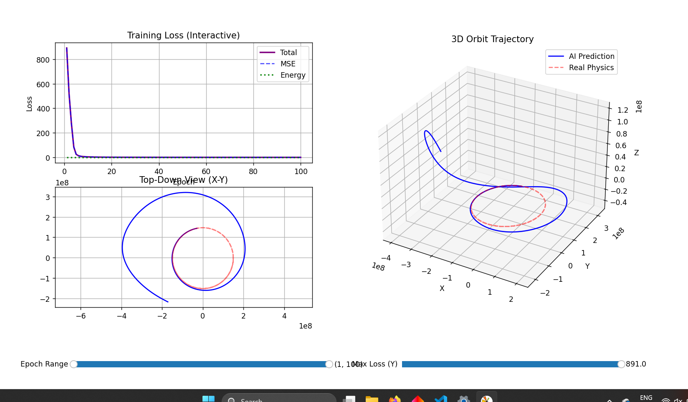

# Orbital Mechanics - Hamiltonian Neural Network (HNN)

This project implements a Hamiltonian Neural Network to predict orbital trajectories using C++ and Eigen.

## Prerequisites

- **Eigen Library**: This project uses the Eigen C++ library.
  - Download it from [eigen.tuxfamily.org](https://eigen.tuxfamily.org/).
  - Ensure the `Eigen` headers are accessible (either in an `eigen/` folder in the root or in your system include path).

## Compilation

To compile with full optimizations:

```bash
g++ -O3 hnn.cpp -o hnn.exe
```
or if you want it to faster (but machine specific):
```bash
g++ -O3 -march=native hnn.cpp -o hnn.exe
```

## Usage

1. **Prepare Data**:
   ```bash
   python clean_datafiles.py
   ```
2. **Train & Simulate**:
   ```bash
   ./hnn.exe
   ```
3. **Visualize**:
   ```bash
   python plotter.py
   ```

## Files
- `hnn.cpp`: Main HNN implementation.
- `plotter.py`: 3D orbit and loss visualization.
- `test_files/`: Source data for planetary orbits.

## Results



### Analysis of Orbital Deviations

The predicted orbit exhibits noticeable irregularities compared to the ground truth. This divergence can be attributed to several key factors:

*   **Hamiltonian Constraint**: Total energy conservation was incorporated via the loss function rather than being strictly enforced as a hard constraint. Consequently, the Hamiltonian is not perfectly conserved over long durations.
*   **Normalization Challenges**: Significant scale differences in planetary distances (e.g., Icarus ranging from **0.187 AU** to **1.97 AU**) create numerical stability issues during normalization.
*   **Numerical Gradients**: In the absence of an AutoGrad library, gradients were approximated numerically. This approach is inherently less precise than symbolic or automatic differentiation, leading to accumulated errors during backpropagation.
